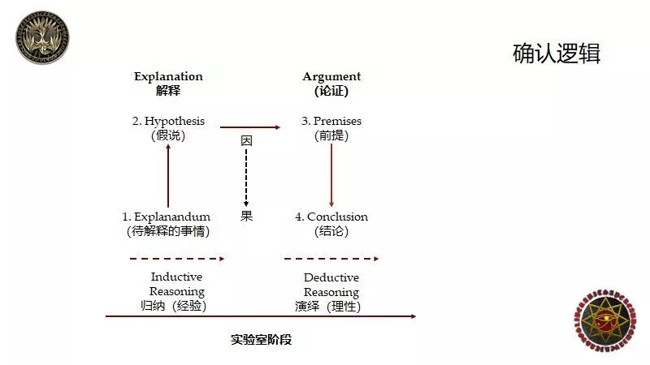
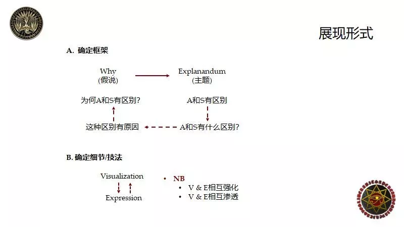
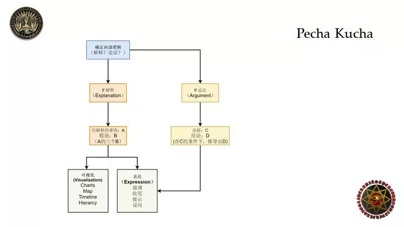

Pecha kucha是一种演讲形式，该演讲规定使用20张演示文稿，并用20秒讲述一张的时间完成（即共6分40秒）。能够帮助你高效演讲输出内容。

当[我们](https://www.w3cdoc.com)想用最大的功率输出时需要考虑两方面的内容：
- 第一确定逻辑，包括Explanation和Argument；
- 第二考虑它的展现形式，包括Visualization和Expression。

前者是内在的，即这件事本身是什么，后者是指演讲者和听众完成信息传递的过程。不管[大家](https://www.w3cdoc.com)使用何种语言，只要是完成信息的输出，这种方法都适用。

你可能会好奇，展现形式好理解一些，但是这跟Explanation和Argument有什么关系呢？Explanation和Argument是[我们](https://www.w3cdoc.com)最常见的内部逻辑的展现形式。从生活角度来讲，两个人聊的热火朝天的关键不在于事件本身，而在于双方对于事件的评价，比如说“吐槽君”中前半部分可能是事实的罗列，但话题升温一定是因为人们对其动机的考察（即Explanation），以及在某一个假设之下所得出的结论（即Argument）；从正式场合角度讲，在一家公司里面，展示者汇报时会展示业绩和数字，但展示数字不是目的，最终是希望从数字中得出某个结论，而这个结论能够让[大家](https://www.w3cdoc.com)保持一种高度集中的状态。

比如，展示者先展示数字，而后给观众解释为什么会该数字出现的原因，并最终抽象出一个结论，总结经验教训，使公司在下一个季度得到更好的业绩。因而无论是正式还是非正式场合，内部逻辑的展现形式不仅限于记叙和描写，这种逻辑发生在[我们](https://www.w3cdoc.com)生活的各个角落。而记叙和描述都是手段而非最终目的，他们的最终目的要么是解释一件事（Explanation），要么是为了提出一个观点去论述（Argument）。

下面[我们](https://www.w3cdoc.com)分别来解释这两方面内容。

## 01 确定逻辑

### 因果关系与相关性

Explanation和Argument在人类的头脑中的外在展现形式几乎一模一样，不论解释一件事情还是要论述一个观点，结构基本一致，两者都涉及到因果关系，只是目的不同。比如说，[我们](https://www.w3cdoc.com)有“一个人很伤心”和“父母亡故”两个要素。此时会出现两种情况，第一种情况，两者间存在相关性。相关性是指“这个人很伤心”和“父母亡故“之间肯定有某种联系，但[我们](https://www.w3cdoc.com)无法确定两者是何种联系。比如说”一个人伤心“和”父母亡故“可能出于同一个原因，推理如下，国破导致”一个人很伤心“，国破导致”父母亡故“，这便是一种相关性，而这其中的一个隐含的前提是父母亡故与他伤心没有什么直接的关联，也就是说这两个事件彼此独立存在，“这个人”可能与他的父母关系不好，且没有太多的感情。第二种情况，两者间存在因果性。因果性是指”父母亡故“直接导致了”一个人很伤心“，因而，因果性是相关性中非常具体的一种。

### Explanation 解读
Explanation和Argument都涉及因果关系，但在Explanation里面，“果”是事实，所以在解释时，[我们](https://www.w3cdoc.com)需要往前追溯原因，因而[我们](https://www.w3cdoc.com)将“果”叫做“待解释的事情“（它是已经发生的具体的事情）。而在往前追溯的过程中，人们往往会加入自己的理解，所以很多人在解释一件事时很容易出现错误归因，或者说人们以为是这样的但事实并非如此。回到现实世界，历史学家整理史料的过程其实就是往前追溯找原因的过程，且历史学中的“因果”都是具体的事情，比如说希特勒发动全欧战争，希特勒参加过一战并且受过极端思想的洗礼，德意志当时受过19世纪浪漫主义哲学和文化的影响，种族主义的概念和达尔文提出的进化论的思想开始蔓延，这几件事都是事实，但当历史学家做研究时，很有可能将后面的几点作为希特勒发动全欧战争的原因，但问题是，这几点一定是希特勒发动全欧战争的原因吗？不一定，[我们](https://www.w3cdoc.com)只能说这几点的可能性较大，但[我们](https://www.w3cdoc.com)没办法百分百确定。总结一下，[我们](https://www.w3cdoc.com)把知道结果后往前追溯原因的过程称为Explanation，原因[我们](https://www.w3cdoc.com)管它叫做Hypothesis，结果叫Explanandum（待解释的事情）。

### Argument 解读

Explanation和Argument有何区别呢？第一，Argument里面的“Premise to Conclusion&#8221;和Explanation里面的 &#8220;Hypothesis to Explanadum&#8221;结构相同，但方向相反。以“只要你花时间就一定能提高成绩”为例，在Argument里面，“只要你花时间就一定能提高成绩”这句话本身就是一个Argument；而用Explanation的方式，[我们](https://www.w3cdoc.com)可以解读为“这个人的成绩提高了很多，他一定花了很多时间。”第二，Argument里面的因果跟Explanation里面的因果的确定性是相反的。Explanation里面的果（Explanandum）是事实，是确定的，是一个待解释的事情，Explanation这个过程是[我们](https://www.w3cdoc.com)知道了结果后往前追溯原因，因而这个因是假说（Hypothesis），是不确定的。Argument中的Premises（前提）是“因”，是确定的，Argument这个过程是[我们](https://www.w3cdoc.com)根据这个前提最后推理得出一个结论，而这个结论是“果”，是不确定的。

### 理解升级
自然科学和社会科学都经历了两个阶段：第一个阶段是实验室阶段（Explanation），[我们](https://www.w3cdoc.com)做的每一个实验都是果（Explanandum），是事实（Fact），是确定的、是“待解释的事情”，而后你提出一个假说（Hypothesis），是“因”，这个假说是不确定的，是需要验证的。第二个阶段是论证阶段（Argument），假说（Hypothesis）包含前提（Premises）和结论（Conclusion），此时你需要进行进一步的验证，看前提（Premises）能否得出结论（Conclusion），这便完成了整个科学的过程。

举个例子，[我们](https://www.w3cdoc.com)现在提出一个果（Explanandum）：两个人在最初的时候观念并没有固化，但经过争吵之后，原有的印象将会被强化。接下来，[我们](https://www.w3cdoc.com)看一下它分别是怎样经历这两个阶段的。

首先第一步是实验室阶段（Explanation），心理学家观察到原本两人观点相似，只是中间有一点小差别，比如说你父母让你考公务员，当你跟父母之间没有冲突时，家长认为公务员可能是一个更好的选择，但如果你想选择北漂，其实也未尝不可。你的想法是北漂可能会更好一点，但做公务员也可以。但争吵之后，爸妈的想法变成了公务员成了唯一的选择，北漂就是不务正业。此时，你的想法变成了北漂就是最正确的选择，公务员就是浪费生命，此时你们的观点都被强化了，到这为止还依然处于实验室阶段。

第二步是论证阶段（Argument），此时，心理学家提出了某一项假说（Hypothesis），称该现象为逆火效应（遇上与自身信念抵触的观点或证据时，除非它们足以完全摧毁原信念，否则会忽略或反驳它们，原信念反而更加强化。），并将此固化下来且加以验证。这个过程是：双方必须满足以下前提（Premise）得出最后的结论（Conclusion）：双方观点大体一致但有微小差别，双方在争吵之前没有从对方角度思考问题。这些前提一定会导致一个结果，即：本来是讨论问题，最后变成了激化问题。

到现在为止看明白了吗？

再举个例子，就学科而言，有的学科里面存在大量的Explanation，而有的学科中为Argument。比如，历史学基本都是Explanation，而大量的社会科学，如心理学都是Argument。Explanation是归纳推理（Inductive Reasoning），是经验的，即它的原因是[我们](https://www.w3cdoc.com)从事实本身抽象出来的；Argument是演绎推理（Deductive Reasoning），是理性的，从前提（Premise），进行逻辑推演，最后推导出一个结论（Conclusion）。历史中大量的历史事件都是待解释的事物（Explanadum）。而[我们](https://www.w3cdoc.com)提出的各种各样的理论，比如十字军东征里面的人类本性（Human Nature）和教权在增长过程中对权力的渴望都是假说（Hypothesis）的一个部分，因而历史的题材非常简单，就是Explanation，这也就解释了为什么历史学家总是在喋喋不休的吵，因为他没有办法完成Argument，因为[我们](https://www.w3cdoc.com)没有办法把它放在实验室环境中观察，[我们](https://www.w3cdoc.com)知道的只能是一件又一件Explanadum（待解释的事情），[我们](https://www.w3cdoc.com)唯一能做的就是把历史事件尽可能完成的呈现，然后筛选出具有最强的解释效果的事件。

### 确定框架和结构

通过前面的讲解[我们](https://www.w3cdoc.com)知道，在Explanation中，你需要确定的是果（Explanadum）,而在Argument中，你需要确定的是前提（Premises）。果（ Explanadum）确定后往前追溯因，便可提出假说（Hypothesis）；在Argument中， 你需要确定前提（Premises），由一个个前提最终推演出结论（Conclusion）。

因此做好Pecha Kucha分两个阶段：<strong class="content-strong">第一个阶段为准备阶段，第二个阶段为展示阶段。</strong>准备过程为从果（Explanadum）往回追溯原因（Causes）的过程；原因确定以后，在展示环节，[我们](https://www.w3cdoc.com)应该先给假说（Hypothesis），假说包括前提（Premise）和结论（Conclusion），推理过程为，先给出前提（Premise），中间讲事情发展的过程，最后得出一个结论（Conclusion）。

举个例子，有的同学在做Pecha Kucha的时候会对比雅典和斯巴达，当提出“Why did they differ？”时，这里面包含两层信息，分别是“They”和”Differ“. They differ&#8221;是指&#8221;There are the differences between Athen and Sparta&#8221;，这是果（Explanandum），是待解释的事物；Why是原因（The Causes），即[我们](https://www.w3cdoc.com)需要找Origins. 为什么这个展现形式非常好？因为演说者在展现的过程中，一上来给观众的是一个关键词（待解释的事情：Explanadum），也就是主题（Topic）和我将会去解释的Why（Hyphothesis）。在随后的的演说中，演说者为观众展现两个主体（雅典和斯巴达）之间的关系。也就是说，听众在看第一页时并不知道Athen和Sparta这两个关键词的具体含义，但当他们听完Presentation后知道，雅典和斯巴达这两个地方是有区别的，同时他还知道这件事是有原因的。演说的逻辑是演说者的演说分三步，第一步是告诉[大家](https://www.w3cdoc.com)雅典和斯巴达有区别，且这个区别有原因的；第二步是详细论述两者之间的具体区别；第三步具体分析造成区别的原因。演说的展现形式是雅典是怎样的，斯巴达是怎样的，两者有何区别，造成这种区别的原因是什么。

### 确定具体细节和技法
刚才说过，展现形式分两部分，第一部分是“确定大的框架和结构”，涉及到两种逻辑，分别是解释（Explanation）和论证（Argument）；第二部分是”确定具体的细节“，则需要具体的，非常细节的技法，包括可视化（Visualization）和

[大家](https://www.w3cdoc.com)在做Pecha Kucha时都用到了这两种技法，我最担心的不是[大家](https://www.w3cdoc.com)可视化或表达做的不好，最担心的是[大家](https://www.w3cdoc.com)在演说过程中产生了逆火效应，把责任一股脑的推给听众，指责对方“这个你怎样都听不懂。”；同理，当[我们](https://www.w3cdoc.com)与他人沟通时，之所以会出现跟父母沟通不畅，跟朋友们闹掰这种情况，原因在于两方都不愿意担这个责任。Pecha Kucha涉及到两个主体，分别是演讲者和听众，其中前者是可控因素，因为演讲者之所以做Presentation就是因为听众逻辑可能不强，所以当[我们](https://www.w3cdoc.com)在做Presentation时，如果逻辑最差的听众也能听懂并且被你吸引，就意味着你的Presentation是非常成功的。但如果[大家](https://www.w3cdoc.com)不被人们所理解，或者被人们认为“说不明白话”时不要抱怨，因为对你而言，抱怨就相当于听众把责任推到你身上，如果你希望事情变得更好一些，你应该把责任揽到自己身上，从自己的角度出发，不断思考怎样让自己的表达更清楚，怎样让自己的图形展示更清楚，打破知识的诅咒，让逻辑不清的人也能听懂你的演说。

那到底什么是Visualization，什么是Expression呢？别着急，其实这两个概念在[我们](https://www.w3cdoc.com)日常跟朋友聊天的过程中都有用到。 [大家](https://www.w3cdoc.com)注意，可视化不一定非要用图，可视化的关键不在于你用什么图来展示，而在于你给人们脑海中留下了什么图。

下面我将给出三个例子，第一种人在说话时，如果手头没有纸和笔，他便会用打手势的方式表达；第二种人用面部表情，当他说重点时，面部表情特别夸张，语速放缓，这也是可视化的一种表现形式。第三种人比较强，直接把可视化融合到表达里面，这种人说话叫做绘声绘色，也就是他在讲的时候，一定把事情描述的特别清楚。那么我如何用口头表达的方式使特别复杂的理论可视化呢？[我们](https://www.w3cdoc.com)只需要给听众举例子，作类比即可。为什么举例子和作类比会让听众听得更加明白呢？因为例子和类比能够给听众提供一个能够想象到，且能够看得到的场景，这是可视化的一个非常高阶的形态。

由此，[我们](https://www.w3cdoc.com)可以得出第一个结论，Visualization和Expression是可以互换的，[我们](https://www.w3cdoc.com)不一定要将两者割裂来看待，说话说得特别好的人，说出的话在[我们](https://www.w3cdoc.com)的头脑中可以形成一张图，而一个可视化做得好的人，它展示的图片仿佛自己能说话。第二个结论，Visualization和Expression两者不应该互相抵消，而是应该互相强化。比如，有的演说者在可视化方面做得特别好，但因过分依赖PPT，因而在表达方面做得没有那么好。因为眼睛里看是关键词，很多情况下就忘记了去强调重点，忘记要通过语音的方式给各位听众提供更加栩栩如生的描述。

总结一下，第一，Visualization和Expression相互之间是可以渗透的；第二，Visualization和Expression两者不应该互相抵消，而是应该互相强化，即当你引入一个更好的，更流畅的表达时，是不以牺牲可视化为代价的。

## 03 从零开始做好Pecha Kucha

那么，到底如何才能成功地做一次Pecha Kucha呢？
（敲黑板！！划重点！！）

### 第一部分：确定逻辑

第一步：确定内部逻辑（你的意图）。即你到底是想解释一件事（Explanation），还是要论证一件事（Argument）。

第二步：确定逻辑框架。

如果你是要解释一个东西（Explanation），首先确定待解释的事情Explanandum（A）以及原因Hypothesis（B），也就是说如果你要解释一件事，则你要解释什么（A）？接着去找什么可以解释（B），此时便确定了框架。

如果你是要论证一个东西（Argument），逻辑架构为：我有哪些前提Premises（C)，以及我有的这些东西最终会得出什么结论Conclusion（D)。

### 第二部分：确定展现形式
第一步：确定大的框架和结构。 比如说，你可以演讲时一开始说：现在要给[大家](https://www.w3cdoc.com)解释一下A的三个B。 再比如，你要论证的话，那么最终的展现形式为在C的条件下会导致D。具体场景如下，听众会思考，“在C的情况下会导致D”这个观点好新颖呀，但这是为什么呢？演讲者开始讲，[我们](https://www.w3cdoc.com)现在有哪些前提（Premise C），一步一步往下推，最终得出一个结论（Conclusion D）。

第二步：确定具体的细节技法。
Visualization（可视化）：自己是否具备“可视化的材料”，比如是否有充足的表格，图片，恰当的文字说明，是否需要地图，时间轴和流程图？

Expression（表达）：我是否将要表达的内容分成了各个部分？是否强调了重点内容，是否有收尾？是否有提示并回归主题？是否有设问？比如说：有同学会问，为什么是这样呢？他们到底有什么区别呢？只要演说者在最初提出一个问题，立刻就能帮助听众创造出某种代入感。

第三部分：不断回归主线—

不断提醒自己，当我在解释一个图时，是否强调它在哪条主线上？是否给[大家](https://www.w3cdoc.com)做一个总结？是否提示听众[我们](https://www.w3cdoc.com)现在所处的位置；当我在布置任务时，是否已经提出了一个特别明确的问题？因而表达是一个循环往复的过程，每一个环节都是这样一个循环，我去设问，我给你个提示，当我讲到中间时强调关键词，最后收尾总结，然后进行到下一步再是展示。从小包打到中包，从中包打到大包。
