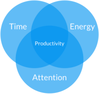

**产出 = 单位时间产能 × 有效工作时间**，要做到高产出，有两条路：

* 增加有效工作时间
* 提高单位时间的产能

## 增加有效工作时间 {#k9Jav}

时间是每个人都拥有的最宝贵、最公平的财富，每天只有 24 小时，不会多也不会少，除去正常生活所需时间，可用作工作和学习的时间大概在 12 小时，[我们](https://www.w3cdoc.com)能做的是让这些时间尽可能用在有价值的事情上。

要有效利用时间，终极大招就是乔布斯实践的：<a href="https://www.youtube.com/watch?v=C-kBkuaOYO4" target="_blank" rel="noopener noreferrer"><em>If today were the last day of my life, would I want to do what I am about to do today?</em></a> 巴西 <a href="https://book.douban.com/subject/26770268/" target="_blank" rel="noopener noreferrer">塞氏企业</a> 的掌门人 <a href="https://baike.baidu.com/item/%E9%87%8C%E5%8D%A1%E5%A4%9A%C2%B7%E5%A1%9E%E5%A7%86%E5%8B%92/11004112" target="_blank" rel="noopener noreferrer">Ricardo Semler</a> 在 <a href="https://www.ted.com/talks/ricardo_semler_how_to_run_a_company_with_almost_no_rules/transcript" target="_blank" rel="noopener noreferrer">How to run a company with (almost) no rules</a> 这个 TED 演讲中也分享了类似做法：_On Mondays and Thursdays, I learn how to die. , I call them my terminal days&#8230;_

但这招太过刚猛，得一定的机缘方可练就，未必适合普通人。美籍作家 <a href="http://leanadelle.com/" target="_blank" rel="noopener noreferrer">Leana Delle</a> 在 <a href="https://www.youtube.com/watch?v=hbG89FYKzaY" target="_blank" rel="noopener noreferrer">Don&#8217;t Live Each Day As If It Were Your Last</a> 这个 TED 视频中讲的分享的：“_If today were the first day of my life, and i have more days ahead, wolud i want to do what I’m about to do today?_” ，对普通人来说更有参考性，接下来就针对“如何利用好每一天”分享一些我的实践。

### 秘诀一：打造免打扰的工作环境 {#oh6tZ}

> 本节讲到的方法未必适合一些需要频繁和人打交道的工种，比如：PM、运营、HR、客服等。
>
> 但其宗旨在打造一个能高效工作的基础环境，方法论也适用于以 IM 为中心的工种。

[我们](https://www.w3cdoc.com)都是普通人，在各大 APP 千方百计抢夺用户时间的局面下，很难做到不受诱惑并保持专注。手机、IM 已让同步沟通成为人们的习惯，对于有些工种 IM 就是他们的生产工具，但对技术、设计等创造型工种而言，IM 则是效率杀手，小红点 + 消息会让时间彻底碎片化，不仅让你失去专注工作的机会，久而久之还会大脑一起碎片化掉，让你丧失深度思考的能力以及专注力，高效工作首先得打败它们。

在同步沟通已深得人心的时代，逆势而行构造 <a href="https://www.google.com/search?ei=C7IhXdOzN4S7tQa4iLd4&q=asynchronous+communication+in+the+workplace" target="_blank" rel="noopener noreferrer">异步沟通</a> 环境其实蛮难的。这个过程最难驯服的是 IM，这里以我所在公司使用的钉钉为例介绍如何在 Mac 下把 IM 变成一个异步沟通工具。我大概花了 100 块 + 3 个月才把它彻底变成一个异步沟通工具，花这么长时间主要是逐步训练大脑不再关注 IM。

先看我的电脑桌面：

完全看不到任何红点，怎么做到的呢？

大致分这几步：

**1、在钉钉设置中关掉提醒：**

桌面通知可保留，因为这样可以做到有人钉时可以看到：

**2、在「****系统偏好设置 -> 通知****」中关掉所有提醒、角标：**

**3、驯服钉钉 ICON，把它调到视线盲点**

> ICON 只要在视线类，总会忍不住去看，因为你知道哪里可能会有信息，让它从视线消失是最好的做法。

**第一步：隐藏工具栏的钉钉 ICON 及其它你不想看的 ICON**

钉钉顶部栏里的 ICON 没法通过设置隐藏，只能借助付费软件 <a href="https://www.macbartender.com/" target="_blank" rel="noopener noreferrer">Macbartender</a> 。

<a href="https://www.yuque.com/vagusx" target="_blank" rel="noopener noreferrer">@vagusx</a>  提供了一个免费工具：<a href="https://github.com/Mortennn/Dozer" target="_blank" rel="noopener noreferrer">Dozer</a> ，功能没 Bartender 强，但足以对付这些 ICON 。

**第二步：程序坞中的 ICON 放在左下角这个视觉盲区**，需要时可快速唤起即可，我把它和 Outlook 放一起：

为了让它一定在底部，还得多放一些应用 ICON 出来&#x1f604;

**4、在钉钉里把能退的群退掉，能静音的静音，然后把最相关的群、经常协作的同事置顶：**

这样能保证打开钉钉后首先看到的是需要去优先处理的消息。

经过上边这些改造，基本上就能重新夺回主动权了。剩下的就是去训练大脑不去想钉钉，这块除了刻意去练习外没啥好的办法。可以先从周末不开钉钉训练起，还可以通过转移注意力来达成，比如：把原本放钉钉的地方，换成一个 ToDo 软件，提醒自己还有哪些工作没完成。

钉钉本身也有“专注模式”，但其实只是对消息进行了分类，方便按类别处理，该有的小红点、数字角标还是会有，只要它们还在视线内，这些魔性数字还是会吸引注意力。这种模式下，想要全部处理完消息，就需要频繁在不同组之间切换，反而没有列表式方便。所以，还是把它调教成异步沟通工具更彻底，仅在需要与人沟通时唤起。

**如果还想再进一步专注**，可以尝试工作日：

* 不看微博
* 不刷知乎
* 不看新闻
* 不刷抖音
* 不看公司论坛
* &#8230;

不用担心被贴上响应不及时的标签，因为：重要的事情对方会电话、钉、当面找你，不重要的事情晚点回复也无妨，没准在不回复的这段时间内对方已经摸索着自己解决了。

**更不用担心会错过什么大事情，因为一旦是需要你关心的大事情，总会顺着身边的人触达到你。**

### 秘诀二：错峰工作 {#aNtLN}

[我们](https://www.w3cdoc.com)**每天要做的事情无非三类**：

* **思考**：想事情该怎么做、代码该怎么写，总结和规划工作
* **执行**：落实工作，把所思所想转换为成果
* **学习**：学技术、阅读、听演讲等

**可利用的时间**：

* **办公室时间**：恐怕是除了睡觉外待最大的可用时间
* **碎片化时间**：上下班路上、吃饭时等饭、睡前、晨起等
* **周末**：修正为主，但仍有少了时间可用作学习和思考

<u>初步错峰 - 在合适的时候做合适的事</u>

* **思考**：随时随地均可，且无需协作，完全可以通过碎片化时间、周末闲暇时完成
* **学习**：需要安静的环境 + 充裕的时间，碎片化时间只能获取信息，不足以承载有效学习，周末、晚上是好时机
* **执行**：留给办公室时间，期间的思考和学习也要收敛到在执行过程中需要解决问题上

初步错峰后，就可以把办公室时间留给执行工作了。要保持高效，就需要<u>二度错峰 - 高效利用办公室时间</u>**。**

工作中需要执行的任务（以码农为例），按需要投入的专注度可分为：

* **高度专注**：写代码、做设计、调试代码、写文章
* **中度专注**：测试、定位并修复 Bug、看 MR、参加评审、学习技术
* **低度专注**：处理邮件、钉钉、反馈等

而办公室的环境情况（以互联网公司为例），按安静程度大致可分为：

* **安静**：上午 11 点前、下午 1点-2:30、晚上 7:30 后
* **适中**：上午 11点-12:30、下午 2:30-4点
* **热闹**：下午 4点-6点

要做到高效工作，[我们](https://www.w3cdoc.com)要做的是：

* **安静期**：做需高度专注的事
* **适中期**：完成中度专注就能搞定的事
* **热闹期**：做低度专注即可完成的事

要做好这个匹配，和大多是人同时上下班是比较难做到的，因为[我们](https://www.w3cdoc.com)还需要调整状态去适应这个节奏，而 10 点到公司的话，等你刚准备好工作时，已经错过了第一个安静期，接下来节奏很容易被周边氛围和个人状态带偏。大环境很难改变，但[我们](https://www.w3cdoc.com)可以改变自己，这里介绍一个非常有效的方式：**错峰上班，比主流上班时间提前 2 小时候到公司，****每天 8 点半前到公司，将会比别人多了两小时的高效工作时间。**我的两位同事 <a href="https://www.yuque.com/kai.fangk" target="_blank" rel="noopener noreferrer">@写轮</a>、<a href="https://www.yuque.com/yubo" target="_blank" rel="noopener noreferrer">@玉伯</a> 做得很好，写轮还专门写了一个文章：<a href="https://www.yuque.com/kai.fangk/wave-balance/uhw4fc" target="_blank" rel="noopener noreferrer">早起 2/8 定律</a> 来介绍早起的好处，核心思想是：

<blockquote class="lake-alert lake-alert-info">
 早起额外的2小时, 能额外获得你人生中&#8221;本应该&#8221;有的 80% 的财富, 工作的8小时, 只对应剩下的 20%;
</blockquote>

做好这两步错峰，基本上就能保证有充足的有效时间了。如果还想更进一步，可以实践**<u>高阶</u>**<u>错峰 - </u><a href="https://www.yuque.com/kai.fangk/wave-balance/drg0yb" target="_blank" rel="noopener noreferrer"><u>调峰削谷</u></a>**：把最佳状态用到极致，把非安静期的影响降低并有效利用起来。**这里介绍两种削谷方法：

* **热闹期 -> 适中期**：找个安静的会议室讨论问题、做设计评审
* **适中期 -> 安静期**：把需要安静工作的任务拆解为适中环境下也能完成的

高阶错峰适合自控力、任务拆解能力教强者，但可以通过持续调优工作模式来达成。

除了个人外，在团队层面需要<u>错峰协作：</u><u>把安静时间留给[大家](https://www.w3cdoc.com)专心工作，把会议放在其它时段</u>，可尝试：

* 评审放在下午 4点-6点，单个控制在一小时，在公司最热闹的时间段去一个安静的会议室一起探讨产品和技术。会议室优先选有窗户、环境好的，良好的环境有助于激发创意。
* 会议遵循最小化原则，可参考：<a href="https://www.ifanr.com/366790" target="_blank" rel="noopener noreferrer">亚马逊的“两个披萨” 和 “六页备忘录”</a>
  - 能不开就开，能少拉人就少拉人
  - 必须得开就在会前准备好资料，没看资料就不要参加
  - 可去可不去的会就不要去，去参加的务必先看完资料
    
**看到这里你可能会问：当[大家](https://www.w3cdoc.com)都 8 点半到时，这些方法岂不是失效了？**

无需担心，因为整个行业是 10 点半左右，大势难改，一旦真的改变了，你可以再提前到 7 点半即可&#x1f604;

**只能随大流 10 点左右到公司，怎么办？**

错峰吃饭：午饭、晚饭快速吃完，利用好下午 12:30-3点、晚上 6:30 后，这样也能转换点安静时间出来。当然还可以持续修炼“调峰削谷法”，转换部分时间出来。

> 有些夜行工程师就另当别论了，因为他们采用的是另一种错峰：晚上高效工作，白天处理需要中度、低度专注即可完成的事情。但不建议这种，毕竟[我们](https://www.w3cdoc.com)的生物钟是日出而作、日落而息。

### 秘诀三：倒排工作中止时间 {#j05st}

「倒排上线时间」非常常见，甚至已成为很多行业的行规。但它会营造一种无形的压力，而且催生 996 及低效工作。这里讲另一种思路：**倒排工作中止时间**，看似非主流，但却能激发人的创造力和潜力，达成真高效。

很多时候之所以会把工作搞成 996 甚至 007，往往在于：内心深处默默把全部时间都算进去了，认定了会加班，于是不自觉地就选择了**「延长劳动时间」**这条简单且“政治正确”的路，而不是去挑战**「高效工作」**这条难走的路。一旦有了这个心理预期，潜意识里就会觉得还有很多时间可用，自然就不会在提高效率上花心思了。这种工作方式其实是低效且不可持续发展的，因为[我们](https://www.w3cdoc.com)都是凡人，精力有限，不可能总以这样的强度工作。当然，也有高效 996 ，但前提是先得做到高效工作，而且阶段目标在全力以辅下是可达成的。

恰好有一个管理学定律**「**<a href="https://www.jianshu.com/p/a3619db83d5f" target="_blank" rel="noopener noreferrer">帕金森定律</a>**」**也讲到这点：**只要还有时间，工作就会不断扩展，直到用完所有的时间。**换种说法就是：**工作总是会拖到最后一刻才会被完成**。

既然工作总会在最后一刻被完成，那么可以得出这个推论：**只要设定合理的工作中止时间就能反推[我们](https://www.w3cdoc.com)提升效率**。基于这个推论，下边是我的一些实践：

**实践一：工作日最晚不超过 11 点。**

这样做也是为了落实错峰工作，并且在晚上可有少许看书学习时间。

但目前执行得很一般，以至于看书时间没怎么落实。

年初还立了个目标：9 点半离开公司，但兑现率不足 1/4&#x1f613;

不过有一条底线一直在坚持：11 点前停止工作。

**实践二：周末不工作。**

是为了**可持续发展**，毕竟[我们](https://www.w3cdoc.com)要工作几十年，劳逸结合才能走完这场长跑。我非常喜欢清华的一个口号：<a href="https://baike.baidu.com/item/%E4%B8%BA%E7%A5%96%E5%9B%BD%E5%81%A5%E5%BA%B7%E5%B7%A5%E4%BD%9C%E4%BA%94%E5%8D%81%E5%B9%B4/12387663" target="_blank" rel="noopener noreferrer">为祖国健康工作五十年</a>，虽然没信心写 50 年代码，但还是希望能写 20 年甚至更远。为了落实**「可持续编程」**这个理念，我会把周末留给学习和修整，为长久工作蓄能，通常做这几件事：

* **运动**：4-6 小时徒步，洗肺的同时还可以想东西，偶尔有人同行时还可以相互探讨和交流
* **学习 & 总结**：总结本周工作 & 安排下周工作、看文献、整理 <a href="https://github.com/zenany/weekly" target="_blank" rel="noopener noreferrer">Weekly</a>
* **自由分配**：陪家人、睡觉、做饭、看书、打游戏、看电影&#8230;

当然在某些非常时期，即便工作日高效工作仍无法完成任务时，可以这样协调时间：

* 把晚上的学习时间用来工作
* 从周末中拿出一天来工作

但有一点要尽可能坚守：**即便再忙，每周也要留出可自由支配的****一天****，进行修整 + 恢复能量，**这也是可持续工作的基本保障。曾经我只是觉得每周有这样一天能保证下周有一个好的工作状态，但当我在 <a href="https://baike.baidu.com/item/%E9%87%8A%E4%B8%80%E8%A1%8C/3851150" target="_blank" rel="noopener noreferrer">一行禅师</a> 的<a href="https://book.douban.com/subject/4726852/" target="_blank" rel="noopener noreferrer">《正念的奇迹》</a>中看到<a href="https://www.luoxia.com/zhengniandeqiji/97400.htm" target="_blank" rel="noopener noreferrer">「</a><a href="https://www.luoxia.com/zhengniandeqiji/97400.htm" target="_blank" rel="noopener noreferrer">正念日</a><a href="https://www.luoxia.com/zhengniandeqiji/97400.htm" target="_blank" rel="noopener noreferrer">」</a>时，才发现这一天原来还是一种修行。

## 提高作战能力 {#Exf5P}

有效利用工作时间只能保证在生产力不变的情况下产出最大，但当时间都充分利用后，其天花板也就到了，因为[我们](https://www.w3cdoc.com)没法让一天变成 48 小时。若要再往前走一步，就只有提高作战能力了，这是高效工作的终极之道，是一条值得持续探索实践之路，它给个人、团队、企业甚至社会所带来的提效是指数级的。提高的典型做法是：**向工具和分工要效率**，下边以我从事的 UI 开发为例分享一些我的思考。

### 秘诀一：成为多面手 {#l5NlW}

好处很多，不再详述。在国外，一流的工程师、设计师、产品经理都掌握至少两个技能。硅谷的现在就是国内互联网公司的未来，[我们](https://www.w3cdoc.com)应该努力向国外看齐，让自己能掌握多项技能，做到一专多强，成为一名“特种兵”。

### 秘诀二：优化生产工具 {#kYUiq}

**构建、发布、回滚蜗牛一样慢**，被 PHP + jQuery 时代秒成渣了，有时候改个代码 10 多秒后才能看页面效果&#8230;

这段编译时间很尴尬，几乎没法利用，而且将好不容易形成的专注时间再次碎片化成一个个片段。

**管理后台居然还要****投入设计师、PD、工程师研制**，内容类产品到后期会有各种 MIS 系统，但 MIS 这么成熟的领域让新人或实习生练手勉强还说得过去，投入精兵实在有点可惜，期望能通过一些搭建工具搞定。

**一些没有逻辑的 UI 居然还要开发**，而且还得设计师和工程师一起核对细节，期望能做成设计师设计好后就能生成一个直接可用的 js 然后配一下文案就能搞定。

**要数据还得专门的工程师支持**，其实应该有一个好用的数据工具让[大家](https://www.w3cdoc.com)只需要会 Excel、SQL、<a href="https://jupyter.org/" target="_blank" rel="noopener noreferrer">Jupyter Notebook</a> 就能提取想要的数据并进行分析。

仔细剖解日常工作流程，还可以发现很多这样的案例，迫切需好的工具把人从这些低质量的重复工作中解脱出来。

这是一条漫长的提效之路，但在落实过程中，要避免 <a href="http://www.sohu.com/a/126020757_467792" target="_blank" rel="noopener noreferrer">过早优化</a>，只做当下最有价值的。

## 结 {#M3a3A}

过硬的技能 + 强大的工具 + 有效的工作时间能保证[我们](https://www.w3cdoc.com)高效率完成工作，但并不保证一定有高产出，因为一旦方向走偏，效率越高反而离目标越远。管理学大师德鲁克总结了一个管理原则：<a href="http://www.360doc.com/content/15/0518/09/17380219_471375473.shtml" target="_blank" rel="noopener noreferrer">做正确的事</a>，精辟地道出了高效能的秘诀。但这个道理知易行难，考验的是一个人、一个组织的深层能力，对一个组织则尤为重要。

前边介绍的这些方法最终都落在**「让自己****专注在利用有限时间创造价值和提升自我****」**上，在其背后是需要修炼的三种能力，恰好对应三本书：

**心流**

<a href="https://book.douban.com/subject/27186106/" target="_blank" rel="noopener noreferrer">https://book.douban.com/subject/27186106/</a>

[我们](https://www.w3cdoc.com)在做某些事情时，那种全神贯注、投入忘我的状态——这种状态下，你甚至感觉不到时间的存在，在这件事情完成之后[我们](https://www.w3cdoc.com)会有一种充满能量并且非常满足的感受，其实很多时候[我们](https://www.w3cdoc.com)在做自己非常喜欢、有挑战并且擅长的事情的时候，就很容易体验到心流，比如爬山、游泳、打球、玩游戏、阅读、演奏乐器还有工作的时候。

**自控力**

<a href="https://book.douban.com/subject/10786473/" target="_blank" rel="noopener noreferrer">https://book.douban.com/subject/10786473/</a>

提供了循序渐进的方法，帮助你认清自己的目标，增强自控力，并做出改变一生的决定——无论这个决定是减肥、管理收支、减缓压力、克服拖延症、成为好家长，还是找到你的生活重心。和自控力强相关的还有一本书：<a href="https://book.douban.com/subject/26895993/" target="_blank" rel="noopener noreferrer">刻意练习</a>，没有它很难形成自控力。

**终身成长**

<a href="https://book.douban.com/subject/27154533/" target="_blank" rel="noopener noreferrer">https://book.douban.com/subject/27154533/</a>

[我们](https://www.w3cdoc.com)获得的成功并不是能力和天赋决定的，更受到[我们](https://www.w3cdoc.com)在追求目标的过程中展现的思维模式的影响。你认为才智和努力哪个重要，能力能否通过努力改变，决定了你是会满足于既有成果还是会积极探索新知。只有用正确的思维模式看待问题，才能更好地达成人生和职业目标。与之相关的还有一本书：<a href="https://book.douban.com/subject/30203060/" target="_blank" rel="noopener noreferrer">终身学习</a>，讲的也是成长思维。仔细观察，不难发现：大学毕业是很多人学习的终点，少部分人能延续到工作后 5 年，能以初学者之心持续学习者非常少。所以，只要持续学习，一定会比那些停止学习的人走得更远。

工作是一项长跑，人生更是一项长跑。只要持续去探索和实践如何提升这三种能力，肯定能找到最适合自己的节奏，创造出更多的价值。

## 后记 

### A Life of Productivity {#ifhaW}

有位叫 贤月」的读者推荐了一篇和本文观点类似的文章：<a href="https://mp.weixin.qq.com/s/OW6ES5i5hxpX6d-g057etQ" target="_blank" rel="noopener noreferrer">如何从瞎忙族升级为高效牛人</a>，文章介绍了这本书：<a href="https://book.douban.com/subject/27080718/" target="_blank" rel="noopener noreferrer">别让无效努力毁掉你</a>，英文名是 <a href="https://alifeofproductivity.com/the-productivity-project/" target="_blank" rel="noopener noreferrer">The Productivity Project</a> 。作者是 <a href="https://alifeofproductivity.com/welcome/" target="_blank" rel="noopener noreferrer">Chris Bailey</a>：专注于高效能方法的探索，他的研究成果备受媒体和企业关注，TED 大会也邀请他演讲 <a href="https://www.youtube.com/watch?v=Hu4Yvq-g7_Y" target="_blank" rel="noopener noreferrer">How to Get Your Brain to Focus</a> ，并介绍他“**可能是这个世界上最高效的人之一**”。Bailey <a href="http://www.sohu.com/a/276933207_120019197" target="_blank" rel="noopener noreferrer">也推崇心流理论</a>，这本书写的非常棒，看了书的目录才发现我讲的原来只是这本书的子集，感兴趣的同学可以深入学习。Bailey 的核心理念是这张图：

非常清晰地指明了的高效的关键在于：让 Time、Attention、Energy 的交集最大化。

高效工作这个话题还可再往前推演一步：为什么做这份工作，属于我的天命究竟是什么？

若能回答清楚这些人生终极问题，高效将是很自然的一件事，因为你的 Time、Attention、Energy 将会自动往你的天命聚拢，高效则是水到渠成的一件事。但这些问题绝非一朝一夕甚至在这一生就能想清楚，在没想清楚前，利用一些方法让当下的工作更高效才是正道，也只有这样才能让[我们](https://www.w3cdoc.com)有更多的精力去探索世界、寻找天命。

人生短暂，光阴易逝，高效之路重在行动，希望每个人都能找到属于自己的高效之路。
